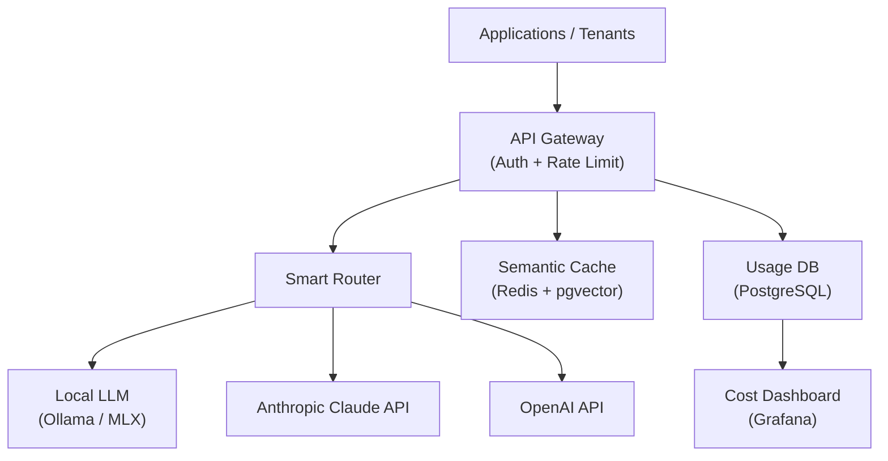
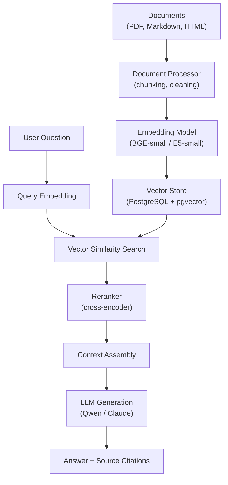

# AI Infrastructure Engineer — Anthropic Transition Plan

## Who This Plan Is For

A senior backend engineer with **10 years at Microsoft and Amazon** who wants to transition into an **AI Infrastructure Engineer** role at Anthropic.

---

## Why You Are Already 70% There

Anthropic explicitly states that **prior AI/ML experience is not required** for many infrastructure roles. They hire for deep systems engineering fundamentals and the ability to operate at scale — exactly what a decade at Microsoft and Amazon provides.

### Your Existing Strengths (Map Directly to Anthropic's Needs)

| Your Experience | Anthropic Requirement |
|:---|:---|
| Large-scale distributed backend systems | Designing and operating distributed inference pipelines |
| AWS expertise (Amazon tenure) | Anthropic's primary cloud is **AWS** |
| Production reliability, on-call, troubleshooting | Operating mission-critical AI serving systems |
| REST/gRPC API design at scale | Building and maintaining model serving APIs |
| CI/CD, deployment pipelines | Continuous deployment of AI services |
| Database design, data pipelines | Data infrastructure for training and evaluation |
| Load balancing, auto-scaling | GPU-aware load balancing and autoscaling |
| Infrastructure as Code (Terraform) | Terraform is a core tool at Anthropic |
| Production observability | AI-specific observability (latency, tokens/sec, GPU utilization) |

### What You Need to Learn (the 30%)

| Skill Gap | Priority | Why |
|:---|:---|:---|
| Python fluency (production-grade) | **Critical** | Anthropic's primary language for ML infra |
| Rust basics | Medium | Used for performance-critical tooling |
| LLM inference internals (KV cache, batching, quantization) | **Critical** | Core knowledge for system design interviews |
| GPU/accelerator concepts (not CUDA programming) | **Critical** | Understanding compute constraints |
| Kubernetes internals (scheduling, resource mgmt) | High | Beyond basic usage — Anthropic operates hyperscale clusters |
| AI safety concepts (RSP, Constitutional AI) | **Critical** | Required for culture/values interview round |
| vLLM, Triton, inference serving engines | High | Key tools in the ecosystem |

---

## Anthropic's Interview Process (What to Expect)

### Stage 1: Recruiter Screen (30-45 min)
- Your background and career trajectory
- **Why Anthropic specifically** — must go beyond "I'm interested in AI"
- Must articulate understanding of Anthropic's mission and safety focus

### Stage 2: Technical Screen (55-90 min)
- **NOT LeetCode** — practical engineering in a collaborative environment (Replit/CodeSignal)
- Write production-quality Python code
- Focus areas: concurrency, error handling, clean API design
- May involve building a small system component from scratch

### Stage 3: Onsite Loop (4-5 rounds)

| Round | What They Test | Your Prep Strategy |
|:---|:---|:---|
| **System Design (1-2 rounds)** | AI-native infrastructure design, not generic web architecture | Study LLM serving pipelines, GPU economics, distributed inference |
| **Coding (1-2 rounds)** | Production Python, concurrency, debugging | Practice async Python, build real systems |
| **Project Deep Dive** | Present a past project with Q&A | Prepare 2-3 Amazon/Microsoft war stories reframed for AI infra relevance |
| **Culture/Values Round** | How you think about AI safety trade-offs | Read Core Views on AI Safety, practice nuanced reasoning |
| **Hiring Manager Round** | Technical decision-making, role fit | Prepare examples of leading ambiguous technical initiatives |

> **⚠️ The culture round is the most common reason strong technical candidates are rejected.** Do not use canned STAR-format stories. Be prepared for an honest, unscripted conversation about your views on AI safety and trade-offs.

---

## Portfolio Projects (What You'll Build for GitHub + Resume)

You need **2 polished GitHub repos** (and 1 optional) that demonstrate you can build the kind of systems Anthropic operates. These are the projects a hiring manager will click on from your resume.

---

### Project 1: Production LLM Serving Platform

**GitHub Repo:** `llm-serving-platform`

**What it proves:** You can build, deploy, and operate a production AI inference system — the core of what Anthropic does.

#### Architecture

```text
                    ┌─────────────┐
                    │   Clients   │
                    └──────┬──────┘
                           │
                    ┌──────▼──────┐
                    │ API Gateway │  ← Auth, Rate Limiting, Request Validation
                    └──────┬──────┘
                           │
                    ┌──────▼──────┐
                    │ Model Router│  ← Routes by model, priority, cost
                    └──────┬──────┘
                           │
              ┌────────────┼────────────┐
              │            │            │
       ┌──────▼──┐  ┌──────▼──┐  ┌─────▼─────┐
       │ Local    │  │ Local   │  │ Cloud API │
       │ Model A  │  │ Model B │  │ (OpenAI/  │
       │ (Qwen)   │  │ (Llama) │  │ Anthropic)│
       └──────┬───┘  └────┬────┘  └─────┬─────┘
              │            │             │
              └────────────┼─────────────┘
                           │
              ┌────────────▼────────────┐
              │    Observability Stack  │
              │ Prometheus + Grafana +  │
              │    OpenTelemetry        │
              └─────────────────────────┘
```

#### Technology Stack

| Layer | Technology | Why |
|:---|:---|:---|
| **API Framework** | Python + FastAPI | Anthropic's primary language; async-native |
| **Local Model Runtime** | Ollama + MLX | Runs on Mac M4; Ollama gives OpenAI-compatible API |
| **Models** | Qwen2.5 7B, Llama 3.2 3B | Fit in 16GB RAM; good quality for demos |
| **Queue / Cache** | Redis | Request queuing, rate limiting, response caching |
| **Database** | PostgreSQL | Usage tracking, audit logs, cost records |
| **Observability** | Prometheus + Grafana + OpenTelemetry | Industry standard; AI-specific dashboards |
| **Containers** | Docker + Docker Compose | Local development and testing |
| **Orchestration** | Kubernetes (minikube/kind) | Demonstrates K8s skills |
| **IaC** | Terraform | Anthropic uses Terraform |
| **Cloud** | AWS (EKS, ALB, CloudWatch) | Anthropic's primary cloud |
| **CI/CD** | GitHub Actions | Standard; deploys to AWS |
| **Load Testing** | Locust or k6 | Performance benchmarks |

#### API Specification

```text
POST /v1/chat/completions      ← OpenAI-compatible chat endpoint
POST /v1/completions           ← Text completion endpoint
GET  /v1/models                ← List available models
GET  /health                   ← Liveness check
GET  /ready                    ← Readiness check (model loaded?)
GET  /metrics                  ← Prometheus metrics endpoint
```

**Streaming response example:**
```text
POST /v1/chat/completions
{
  "model": "qwen2.5-7b",
  "messages": [{"role": "user", "content": "Explain KV cache"}],
  "stream": true
}

→ Server-Sent Events (SSE):
data: {"choices": [{"delta": {"content": "The"}}]}
data: {"choices": [{"delta": {"content": " KV"}}]}
data: {"choices": [{"delta": {"content": " cache"}}]}
...
data: [DONE]
```

#### Repo Structure

```text
llm-serving-platform/
├── src/
│   ├── api/                    # FastAPI routes
│   │   ├── chat.py             # /v1/chat/completions
│   │   ├── models.py           # /v1/models
│   │   └── health.py           # /health, /ready, /metrics
│   ├── core/
│   │   ├── model_router.py     # Routes requests to the right model
│   │   ├── rate_limiter.py     # Per-key rate limiting
│   │   ├── circuit_breaker.py  # Model failover logic
│   │   └── queue.py            # Request priority queue
│   ├── providers/
│   │   ├── ollama.py           # Ollama backend adapter
│   │   ├── openai.py           # OpenAI API adapter
│   │   └── anthropic.py        # Anthropic API adapter
│   ├── observability/
│   │   ├── metrics.py          # Prometheus metrics (TTFT, tokens/sec, etc.)
│   │   └── tracing.py          # OpenTelemetry distributed tracing
│   └── config.py               # Configuration management
├── infra/
│   ├── docker/
│   │   ├── Dockerfile          # Multi-stage build
│   │   └── docker-compose.yml  # Full local stack
│   ├── kubernetes/
│   │   ├── deployment.yaml
│   │   ├── service.yaml
│   │   ├── hpa.yaml            # Autoscaling on custom metrics
│   │   ├── configmap.yaml
│   │   └── ingress.yaml
│   └── terraform/
│       ├── main.tf             # AWS EKS + ALB + VPC
│       ├── variables.tf
│       └── outputs.tf
├── dashboards/
│   └── grafana/                # Pre-built Grafana dashboards (JSON)
├── benchmarks/
│   ├── locustfile.py           # Load test scenarios
│   └── results/                # Benchmark reports with charts
├── tests/
│   ├── test_api.py
│   ├── test_router.py
│   └── test_circuit_breaker.py
├── README.md                   # Architecture, design decisions, benchmarks
└── DESIGN_DECISIONS.md         # Why X over Y (shows engineering judgment)
```

#### Implementation Phases

**Phase 1 (Week 1-2): Core API + Local Model**
- FastAPI app with OpenAI-compatible `/v1/chat/completions`
- Streaming responses via SSE
- Ollama integration for local model serving
- Token counting, request validation, error handling
- Health check and Prometheus metrics endpoints

**Phase 2 (Week 3): Multi-Model Routing + Reliability**
- Model router: route by model name, complexity, or cost
- Request priority queue (Redis-backed)
- Circuit breaker: if Model A fails → fallback to Model B → fallback to cloud API
- Retry with exponential backoff, timeout control

**Phase 3 (Week 4): Observability**
- OpenTelemetry distributed tracing (trace a request from API → model → response)
- Grafana dashboards: TTFT, TPOT, tokens/sec, P50/P95/P99, error rate, circuit breaker state
- Docker Compose for full stack: API + Ollama + Redis + Postgres + Prometheus + Grafana

**Phase 4 (Week 5-6): Kubernetes + IaC**
- K8s manifests: Deployment, Service, HPA (scale on queue depth), ConfigMap, Ingress
- Terraform modules for AWS EKS deployment
- Liveness/readiness/startup probes

**Phase 5 (Week 8): Performance Benchmarks**
- Load test with Locust: sustained load, burst traffic, failover scenarios
- Published benchmark report:

```text
┌─────────────────────────────────────────────────┐
│         Benchmark Results (1000 requests)        │
├──────────────────┬──────────────────────────────┤
│ Metric           │ Value                        │
├──────────────────┼──────────────────────────────┤
│ Avg Latency      │ xxx ms                       │
│ P50              │ xxx ms                       │
│ P95              │ xxx ms                       │
│ P99              │ xxx ms                       │
│ Throughput       │ xxx req/sec                  │
│ Token Rate       │ xxx tokens/sec               │
│ Failover Time    │ xxx ms (Model A → Model B)   │
│ Error Rate       │ x.x%                         │
└──────────────────┴──────────────────────────────┘
```

**Phase 6 (Week 9): AWS Cloud Deployment**
- Deploy to EKS with Terraform
- ALB + CloudWatch + IAM + VPC
- CI/CD via GitHub Actions

---

### Project 2: AI Gateway Platform

**GitHub Repo:** `ai-gateway`

**What it proves:** You can build the kind of multi-tenant API platform that Anthropic's own API team operates. This is the most directly Anthropic-relevant project.

#### Architecture



#### Key Features

**1. Multi-Provider Model Routing**
```text
Request comes in
    │
    ├─ model="fast"    → Route to local Qwen 3B (cheapest, fastest)
    ├─ model="balanced" → Route to local Qwen 7B
    ├─ model="powerful" → Route to Claude API (highest quality)
    └─ model="fallback" → Try local first, fall back to cloud on failure
```

**2. Per-Tenant Authentication + Rate Limiting**
```text
API Key: sk-tenant-abc-123
    │
    ├─ Tenant: "Team Alpha"
    ├─ Rate Limit: 100 requests/min
    ├─ Models Allowed: [fast, balanced, powerful]
    ├─ Monthly Budget: $500
    └─ Usage This Month: $127.50
```

**3. Cost Tracking**
```text
┌───────────┬──────────┬────────────┬─────────────┬──────────┬───────────┐
│ Timestamp │ Tenant   │ Model      │ Input Tokens │ Out Tokens│ Est. Cost │
├───────────┼──────────┼────────────┼─────────────┼──────────┼───────────┤
│ 10:23:01  │ Alpha    │ claude-3   │ 1,200       │ 450      │ $0.0234   │
│ 10:23:05  │ Beta     │ qwen-7b    │ 800         │ 200      │ $0.0000   │
│ 10:23:12  │ Alpha    │ qwen-7b    │ 300         │ 100      │ $0.0000   │
└───────────┴──────────┴────────────┴─────────────┴──────────┴───────────┘
```

**4. Semantic Response Caching**
```text
New Question
    │
    ▼
Generate Embedding
    │
    ▼
Vector Similarity Search (pgvector)
    │
    ├─ Similar cached question found (similarity > 0.95)
    │       → Return cached response (fast, free)
    │
    └─ No match
            → Forward to model → Cache response for future
```

**5. Reliability Layer**
```text
Request → Primary Model
              │
              X (failure / timeout)
              │
              ▼
         Circuit Breaker Opens
              │
              ▼
         Fallback Model
              │
              ▼
         Response (with "fallback" flag in metadata)
```

#### Repo Structure

```text
ai-gateway/
├── src/
│   ├── gateway/
│   │   ├── router.py           # Multi-provider smart routing
│   │   ├── auth.py             # API key validation, tenant lookup
│   │   ├── rate_limiter.py     # Per-tenant rate limiting (Redis)
│   │   └── cache.py            # Semantic response caching (pgvector)
│   ├── providers/
│   │   ├── base.py             # Provider interface
│   │   ├── ollama.py           # Local model provider
│   │   ├── anthropic.py        # Claude API provider
│   │   └── openai.py           # OpenAI API provider
│   ├── billing/
│   │   ├── cost_tracker.py     # Per-request cost calculation
│   │   └── usage_report.py     # Per-tenant usage aggregation
│   ├── reliability/
│   │   ├── circuit_breaker.py  # Per-provider circuit breakers
│   │   ├── retry.py            # Exponential backoff retry
│   │   └── timeout.py          # Request timeout management
│   └── api/
│       ├── routes.py           # FastAPI endpoints
│       └── middleware.py       # Auth, logging, metrics middleware
├── infra/
│   ├── docker-compose.yml
│   └── kubernetes/
├── dashboards/
│   └── cost_dashboard.json     # Grafana cost tracking dashboard
├── tests/
├── README.md
└── DESIGN_DECISIONS.md
```

---

### Project 3 (Optional): Enterprise RAG Pipeline

**GitHub Repo:** Add as a module in `llm-serving-platform` or a standalone `rag-pipeline` repo

**What it proves:** You understand the full data pipeline from raw documents → embeddings → retrieval → generation.

#### Architecture



#### Technology Stack

| Component | Technology | Why |
|:---|:---|:---|
| **Embedding Model** | BGE-small or E5-small | Runs locally on Mac M4 |
| **Vector Database** | PostgreSQL + pgvector | Simpler than a separate vector DB; one less service to operate |
| **Chunking** | LangChain text splitters or custom | Recursive character splitting with overlap |
| **Reranking** | Cross-encoder model (optional) | Improves retrieval precision |
| **LLM** | Qwen 2.5 (local) or Claude API | Answer generation |

#### Key Features
- Document ingestion pipeline: PDF/Markdown → clean text → chunks → embeddings → pgvector
- Semantic search with configurable similarity threshold
- Context window management (fit retrieved chunks within model context limit)
- Source citation: every answer includes which document chunks were used
- Evaluation: retrieval accuracy, answer relevance scoring

---

## 90-Day Execution Plan

### Month 1: Build AI Infrastructure Fluency (Weeks 1-4)

**Goal:** Go from zero AI infra knowledge to being able to have a technical conversation about LLM serving systems.

#### Week 1-2: Python + LLM Fundamentals

**Learn:**
- Production Python: async/await, type hints, FastAPI
- How LLMs work at the infrastructure level (not the math):
  - Tokenization → Prefill → Decode pipeline
  - KV cache: what it is, why it's the memory bottleneck
  - Continuous batching vs. static batching
  - Quantization (FP16 → INT8 → INT4): trade-offs between quality and throughput
- Key metrics: TTFT (Time to First Token), TPOT (Time Per Output Token), tokens/sec

**Build:**
- A FastAPI service wrapping Ollama that exposes an OpenAI-compatible `/v1/chat/completions` endpoint
- Include streaming responses (SSE), token counting, request validation, error handling
- Add health check (`/health`) and Prometheus metrics (`/metrics`)

**Deliverable:** `llm-serving-platform` GitHub repo

#### Week 3: Inference Engine Deep Dive

**Learn:**
- vLLM architecture: PagedAttention, continuous batching engine
- How inference engines manage GPU memory
- Speculative decoding concept
- Tensor parallelism vs. pipeline parallelism (conceptual, not implementation)

**Build:**
- Deploy vLLM locally (or use Ollama as proxy) with multiple model configurations
- Build a model router service that directs requests to different models based on complexity
- Implement request queuing with priority levels
- Add circuit breaker and fallback patterns (primary model → fallback model)

**Deliverable:** Add model routing and reliability layer to `llm-serving-platform`

#### Week 4: Observability + Containerization

**Learn:**
- OpenTelemetry for distributed tracing
- AI-specific metrics: token throughput, prefill latency vs. decode latency, queue depth
- Docker multi-stage builds, container networking

**Build:**
- Full observability stack: Prometheus + Grafana + OpenTelemetry
- Grafana dashboard with AI-specific panels:
  - Request rate, latency percentiles (P50/P95/P99)
  - Token throughput (input tokens/sec, output tokens/sec)
  - Model-level breakdown (which model serves what traffic)
  - Error rates and circuit breaker state
- Docker Compose setup for the full stack (API + model runtime + Redis + Postgres + monitoring)

**Deliverable:** Production-grade observability added to `llm-serving-platform`

---

### Month 2: Infrastructure at Scale (Weeks 5-8)

**Goal:** Demonstrate Kubernetes expertise and build the kind of multi-model gateway that Anthropic operates internally.

#### Week 5-6: Kubernetes for AI Workloads

**Learn:**
- Kubernetes beyond basics: resource requests/limits, node affinity, taints/tolerations
- GPU scheduling in Kubernetes (concepts — you won't have GPUs locally, but understand the abstractions)
- Horizontal Pod Autoscaler with custom metrics (scale on queue depth, not CPU)
- Kubernetes networking: services, ingress, network policies

**Build:**
- Deploy `llm-serving-platform` to a local Kubernetes cluster (minikube or kind)
- Write Kubernetes manifests: Deployments, Services, ConfigMaps, Secrets, HPA
- Implement health checks (liveness, readiness, startup probes)
- Write Terraform modules to define the infrastructure

**Deliverable:** `infra/` directory in repo with K8s manifests + Terraform

#### Week 7: AI Gateway Platform

**Build a production AI gateway** — this is the most Anthropic-relevant project because it mirrors what their API platform team builds:

- **Multi-provider routing:** Local models (Ollama) + Cloud APIs (Anthropic Claude API, OpenAI)
- **Authentication:** API key management with per-key rate limits and usage tracking
- **Smart routing:** Route by model capability, cost, latency SLOs
- **Cost tracking:** Per-request cost calculation, per-user/per-org aggregation
- **Semantic caching:** Cache responses using embedding similarity (Redis + pgvector)
- **Reliability:** Circuit breakers, retry with exponential backoff, timeout control, graceful degradation

**Deliverable:** `ai-gateway` GitHub repo

#### Week 8: Load Testing + Performance Report

**Build:**
- Load testing suite using Locust or k6
- Test scenarios: sustained load, burst traffic, model failover
- Generate a performance report with:
  - Throughput (requests/sec) at various concurrency levels
  - Latency distribution (P50, P95, P99)
  - Token throughput under load
  - Failure rate and recovery time during model failover
  - Resource utilization (CPU, memory)

**Deliverable:** `benchmarks/` directory with reproducible test scripts and results

---

### Month 3: Cloud Deployment + Interview Prep (Weeks 9-12)

**Goal:** Deploy to AWS (Anthropic's primary cloud), polish everything, and prepare for the interview.

#### Week 9: AWS Deployment

**Build:**
- Deploy the full stack to AWS using Terraform:
  - EKS cluster (or ECS for simpler setup)
  - Application Load Balancer
  - CloudWatch monitoring integration
  - IAM roles with least-privilege policies
  - VPC with proper network segmentation
- Set up CI/CD pipeline (GitHub Actions → AWS)

**Why AWS:** Anthropic's primary cloud is AWS. Using GCP for portfolio projects when targeting Anthropic is a missed signal. Your Amazon experience makes AWS the natural choice.

**Deliverable:** Live deployment with Terraform IaC in repo

#### Week 10: RAG System (Optional but Differentiating)

**Build:**
- Document ingestion pipeline (PDF/Markdown → chunks → embeddings)
- Vector storage with pgvector (PostgreSQL extension — simpler than a separate vector DB)
- Retrieval + reranking pipeline
- LLM generation with context injection
- Evaluation metrics: relevance scoring, retrieval accuracy

**Deliverable:** `rag-pipeline` module added to `llm-serving-platform`

#### Week 11: Polish + Documentation

Every project must have:
- **Architecture diagram** (Mermaid or draw.io)
- **README** with: problem statement, architecture, design decisions, trade-offs, deployment instructions
- **Benchmarks** with actual numbers
- **Design decision log:** Why you chose X over Y (e.g., "Chose pgvector over Qdrant because...")
- Clean Git history with meaningful commits

#### Week 12: Resume + Interview Prep (see sections below)

---

## Resume Strategy

### Title Transformation

**Before:**
```
Senior Backend Engineer — Microsoft / Amazon
```

**After:**
```
Senior Backend / Infrastructure Engineer — Specializing in AI Systems & LLM Platforms
```

### How to Reframe Your Existing Experience

You don't need to hide your backend experience — you need to **reframe it** in AI infrastructure language. Examples:

| Amazon/Microsoft Experience | AI Infra Framing |
|:---|:---|
| "Built a high-throughput API serving millions of requests" | "Designed and operated low-latency serving infrastructure for latency-sensitive workloads at scale" |
| "Led migration from monolith to microservices" | "Architected distributed service decomposition with independent scaling and fault isolation" |
| "Designed auto-scaling for seasonal traffic spikes" | "Implemented custom auto-scaling policies based on workload-specific metrics (analogous to GPU-aware scaling)" |
| "Built CI/CD pipeline for 50+ services" | "Established continuous deployment infrastructure for rapid iteration of model serving systems" |
| "Reduced P99 latency from 500ms to 100ms" | "Optimized serving latency through systematic profiling, batching strategies, and caching layers" |

### Portfolio Project Descriptions for Resume

#### Production LLM Serving Platform
- Designed and built an OpenAI-compatible inference serving platform with FastAPI, supporting streaming responses, continuous request batching, and multi-model routing
- Implemented production reliability patterns: circuit breakers, model fallback chains, priority queuing, and graceful degradation under load
- Built full observability stack (Prometheus, Grafana, OpenTelemetry) tracking AI-specific metrics: TTFT, token throughput, and per-model latency distributions
- Deployed to AWS EKS with Terraform IaC, custom HPA scaling on queue depth, and automated CI/CD via GitHub Actions

#### AI Gateway Platform
- Built a multi-provider AI API gateway routing requests across local and cloud LLM providers based on cost, latency SLOs, and model capability
- Implemented per-tenant API key management, rate limiting, semantic response caching (pgvector), and real-time cost tracking with per-org aggregation
- Designed reliability layer with circuit breakers, retry policies, and automatic failover achieving 99.9% availability under simulated failure conditions

---

## Interview Preparation

### System Design: AI-Specific Topics

You will NOT be asked generic "design Twitter" questions. Expect AI-native problems:

1. **"Design an LLM serving platform for millions of users"**
   - Request flow: Client → API Gateway → Load Balancer → Model Serving (vLLM) → GPU Cluster
   - Key concepts: continuous batching, KV cache management (PagedAttention), prefill/decode disaggregation
   - Scaling: GPU-aware autoscaling (scale on queue depth, not CPU), KV-cache-aware routing
   - Trade-offs: latency vs. throughput vs. cost

2. **"Design an AI API gateway (like Anthropic's API)"**
   - Multi-tenant rate limiting and authentication
   - Cost management and usage tracking
   - Model versioning and traffic splitting
   - Safety layers: content filtering, output validation
   - Reliability: circuit breakers, regional failover

3. **"Design a system for safe execution of AI-generated code"**
   - Sandboxing strategies (gVisor, Firecracker, containers)
   - Resource limits, network isolation, filesystem restrictions
   - This maps directly to Anthropic's Sandboxing team

4. **"Design an AI model deployment pipeline"**
   - Model registry, A/B testing, canary deployments
   - Rollback strategies for model quality regression
   - Continuous evaluation and monitoring

### System Design Framework (Anthropic-Specific)

> **Warning:** Do NOT use a rigid "Requirements → API → DB → Scale" template. Anthropic interviewers jump between topics and test cognitive flexibility. Be ready to pivot.

**Recommended approach:**
1. **Clarify (5 min):** Ask about latency targets (TTFT vs. TPOT), throughput, interactive vs. batch workload
2. **High-level architecture (10-15 min):** Sketch the request flow, identify the hardest constraints
3. **Deep dive (15-20 min):** Bottleneck analysis, trade-off discussions — why you chose X over Y
4. **Resilience + observability (5-10 min):** How you handle node failures during long generation, monitoring for quality degradation

### Technical Concepts to Master

#### LLM Inference (Critical)
- KV cache: what it is, why it dominates GPU memory, how PagedAttention solves fragmentation
- Continuous (in-flight) batching: why static batching wastes GPU cycles
- Quantization: FP16 → INT8 → INT4, quality vs. throughput trade-off
- Speculative decoding: draft model generates, main model verifies
- Prefill vs. decode phases: different compute profiles, why disaggregation helps
- Inference engines: vLLM, NVIDIA Triton, TGI — what problem each solves

#### Distributed Systems (Leverage Your Strength)
- Tensor parallelism vs. pipeline parallelism for large model serving
- GPU-aware load balancing and scheduling
- Request queuing under backpressure
- Fault tolerance during long-running inference requests
- Consistent hashing for KV-cache-aware routing

#### Kubernetes (Deep)
- Scheduling on heterogeneous hardware (CPU vs. GPU nodes)
- Resource management: requests, limits, node affinity, taints/tolerations
- Custom metrics autoscaling (HPA with Prometheus adapter)
- Networking: CNI, service mesh, network policies
- Operator pattern for managing stateful AI workloads

#### AWS Infrastructure
- EKS architecture, node groups, Karpenter for autoscaling
- Networking: VPC design, PrivateLink, inter-region connectivity
- IAM: least-privilege, service accounts, IRSA
- Observability: CloudWatch, X-Ray integration with OpenTelemetry

### Coding Interview Preparation

**Language:** Python (primary). Anthropic also values Rust, but Python is sufficient for interviews.

**Focus areas (NOT LeetCode-heavy):**
- Async Python: `asyncio`, `aiohttp`, building concurrent services
- Production patterns: error handling, retries, circuit breakers, graceful shutdown
- Concurrency: thread safety, race conditions, producer-consumer patterns
- Clean API design: request validation, proper HTTP status codes, pagination
- Debugging: reading stack traces, profiling, identifying bottlenecks

**Practice approach:**
- Build small systems from scratch in 60-90 minutes (e.g., "build a rate limiter," "build a task queue")
- Focus on production quality: error handling, logging, testability
- Practice in a collaborative coding environment (Replit, CodeSignal)

### Culture/Values Round Preparation

**This is Anthropic-specific and critical.** Read these before your interview:

1. **Anthropic's "Core Views on AI Safety"** — their founding document
2. **Responsible Scaling Policy (RSP)** — their framework for managing catastrophic risk
3. **Recent research blog posts** — especially on interpretability and Constitutional AI

**Key themes to be ready to discuss:**
- The tension between deploying capable AI and ensuring safety
- Why "race to the bottom" dynamics in AI development are dangerous
- How infrastructure decisions can enable or undermine safety guarantees
- Your perspective on what "responsible development" means in practice
- Second-order effects: how your infrastructure work impacts model safety

**How to approach the conversation:**
- Be intellectually honest — say "I don't know" when you don't
- Demonstrate nuanced thinking — avoid binary "all good" or "all bad" takes
- Show you can reason through ambiguity in real time
- Anthropic's culture is described as "high-trust, low-ego"

---

## Positioning Statement

> "I bring 10 years of operating production distributed systems at Microsoft and Amazon — building the kind of reliable, scalable infrastructure that AI systems require. I've spent the last 3 months going deep on LLM serving internals, inference optimization, and AI-specific infrastructure patterns. I'm drawn to Anthropic because I believe building safe AI requires the same engineering rigor I've applied to production systems throughout my career, and I want to apply that experience where it matters most."

---

## Weekly Time Investment

| Activity | Hours/Week |
|:---|:---|
| Learning (reading, courses, papers) | 8-10 |
| Building (hands-on projects) | 12-15 |
| Interview prep (system design, coding practice) | 5-8 |
| **Total** | **25-33** |

> If you are doing this while employed full-time, expect the plan to take 4-5 months instead of 3.

---

## Key Resources

### Must-Read
- Anthropic's Core Views on AI Safety
- Anthropic's Responsible Scaling Policy
- Anthropic's research blog (especially interpretability posts)
- vLLM paper: "Efficient Memory Management for Large Language Model Serving with PagedAttention"
- "Attention Is All You Need" paper (Transformer architecture — skim for concepts)

### Hands-On Tools
- **Ollama** — easiest way to run LLMs locally on Mac
- **vLLM** — production inference engine (study architecture even if you can't run it on M4)
- **FastAPI** — Python web framework
- **Locust / k6** — load testing
- **Terraform** — infrastructure as code
- **minikube / kind** — local Kubernetes

### Communities
- Anthropic's public Discord / research discussions
- r/MachineLearning, r/LocalLLaMA subreddits
- MLOps Community Slack

---

## Success Criteria

After 90 days, you should be able to:

- [ ] Explain how an LLM inference pipeline works (prefill → decode, KV cache, batching) to another engineer
- [ ] Have 2 polished GitHub repos demonstrating AI infrastructure skills
- [ ] Deploy an AI serving system to AWS with Terraform and Kubernetes
- [ ] Whiteboard-design an LLM serving platform in a 45-minute interview
- [ ] Articulate why you want to work at Anthropic specifically (beyond "AI is cool")
- [ ] Discuss AI safety trade-offs with nuance and intellectual honesty
- [ ] Write production-quality async Python with proper error handling
- [ ] Pass a practical coding assessment building a system component in 90 minutes
