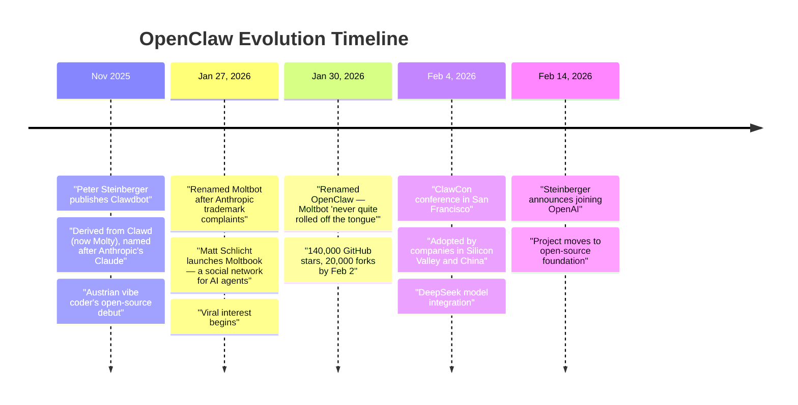
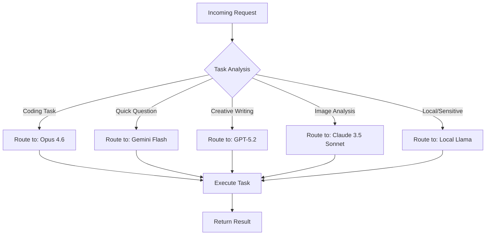
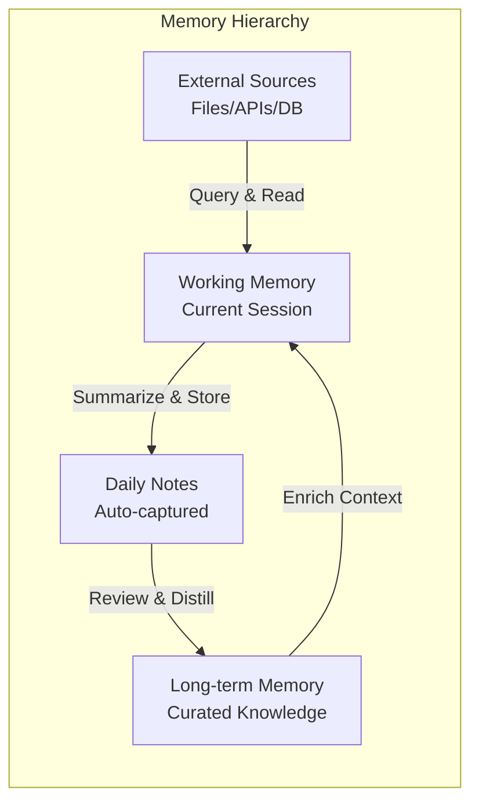
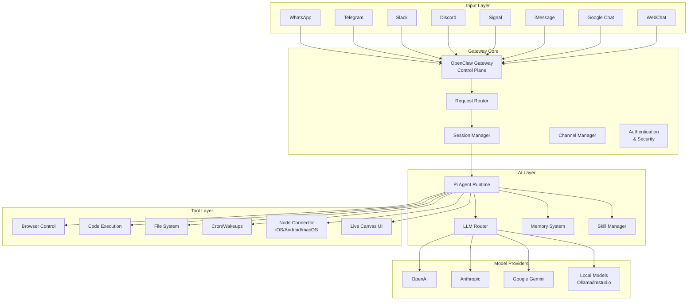
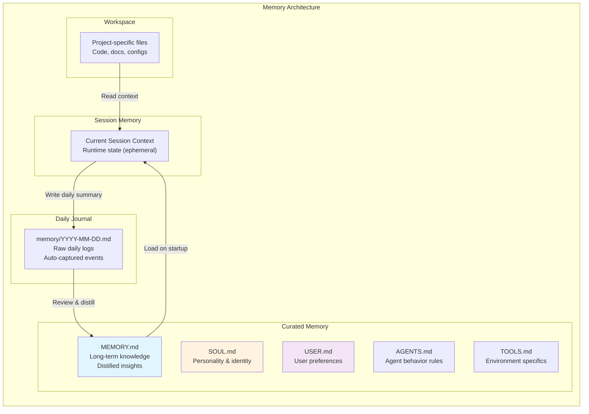
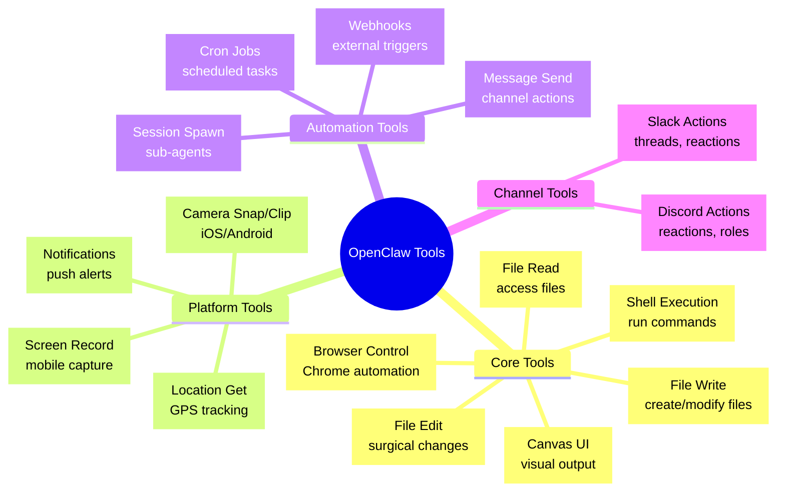

# 🦞 OpenClaw: The Complete Guide to Your Personal AI Agent

*A Stanford CS Lecture on Autonomous AI, Local-First Architecture, and the Future of Human-Computer Interaction*

---

> **Welcome, students!** 
>
> I'm thrilled to guide you through one of the most exciting developments in modern computing: **OpenClaw** — an open-source, autonomous AI agent framework that's redefining how we interact with technology. Whether you're a budding software engineer, a product designer, or simply curious about the AI revolution, this tutorial will give you both the theoretical foundations and practical skills to understand and deploy your own AI assistant.
>
> Let's dive in! 🚀

---

## 📚 Table of Contents

1. [Introduction & Context](#1-introduction--context)
2. [Architecture & High-Level Design](#2-architecture--high-level-design)
3. [Getting Started (Step-by-Step Guide)](#3-getting-started-step-by-step-guide)
4. [Practical Applications & Productivity](#4-practical-applications--productivity)
5. [Optimization, Security & Challenges](#5-optimization-security--challenges)

---

# 1. Introduction & Context

## 1.1 Welcome to the Age of Agentic AI

**What if your computer could actually *do* things for you?**

Not just answer questions or generate text, but *execute tasks*, *manage your schedule*, *control your smart home*, *write code*, and *communicate on your behalf* — all while running privately on your own devices, with your data never leaving your control.

This is the vision of **OpenClaw** (formerly known as Clawdbot and Moltbot before its open-source release).

## 1.2 What Exactly Is OpenClaw?

At its core, **OpenClaw is a personal AI assistant that runs on your own devices** — your laptop, your phone, your home server — and connects to the messaging platforms you already use every day.

Think of it as:
- **A universal remote for your digital life** 🎮
- **An AI intern that never sleeps** 👔
- **A privacy-first alternative to cloud-based assistants** 🔒

### The OpenClaw Ecosystem

```
┌─────────────────────────────────────────────────────────────────────────────┐
│                         THE OPENCLAW UNIVERSE                               │
├─────────────────────────────────────────────────────────────────────────────┤
│                                                                             │
│   💬 CHANNELS          🧠 AI CORE           🛠️ TOOLS            📱 DEVICES   │
│   ───────────          ────────            ───────            ─────────     │
│                                                                             │
│   • WhatsApp           • LLM Routing       • Browser          • macOS       │
│   • Telegram           • Memory System     • Code Exec        • iOS         │
│   • Slack              • Skills/Plugins    • File System      • Android     │
│   • Discord            • Multi-Agent       • Cron Jobs        • Linux       │
│   • Signal                                        • Canvas UI   • Windows     │
│   • iMessage                                                                │
│   • Google Chat                                                             │
│   • Microsoft Teams                                                         │
│   • Matrix                                                                  │
│   • Zalo                                                                    │
│                                                                             │
└─────────────────────────────────────────────────────────────────────────────┘
```

### The "Aha!" Moment

Here's what makes OpenClaw special in one sentence:

> **OpenClaw transforms any messaging app into a command center for AI-powered automation, while keeping everything local and under your control.**

You send a message to your assistant on WhatsApp: *"Summarize my unread emails and schedule a meeting with Sarah for Thursday afternoon."*

OpenClaw:
1. **Understands** your intent (natural language processing)
2. **Accesses** your Gmail (via secure API)
3. **Reads** your calendar (checking availability)
4. **Generates** a summary (using an LLM)
5. **Creates** a calendar event (via Google Calendar API)
6. **Replies** back to you on WhatsApp with confirmation

All of this happens **on your machine**, with your API keys, following your rules.

## 1.3 Why Did OpenClaw Go Viral?

### The Perfect Storm of 2024-2026

OpenClaw didn't become popular by accident. It arrived at the intersection of several transformative trends:

#### 🏠 **1. The Local-First Movement**

People are waking up to the privacy implications of cloud-only AI. When you use ChatGPT, Claude, or Gemini, your conversations are processed on someone else's servers. With OpenClaw:

- **Your data stays YOUR data** 🛡️
- No vendor lock-in
- No training on your private information
- No internet required for local operations

#### 🔓 **2. Open Source = Trust + Innovation**

OpenClaw is fully open source (MIT License). This means:

```
┌────────────────────────────────────────────────────────────────┐
│                    OPEN SOURCE ADVANTAGES                      │
├────────────────────────────────────────────────────────────────┤
│                                                                │
│  ✅ You can audit the code yourself                            │
│  ✅ Security researchers can find and fix bugs                 │
│  ✅ Community contributes features and skills                  │
│  ✅ No hidden tracking or data collection                      │
│  ✅ You can fork and customize for your needs                  │
│  ✅ Transparent development process                            │
│                                                                │
└────────────────────────────────────────────────────────────────┘
```

#### 🌉 **3. The "Chat-First" Interface Revolution**

We're witnessing the death of traditional app interfaces. Instead of opening 10 different apps:

- 📧 Email client
- 📅 Calendar app  
- 🔍 Browser
- 📝 Notes app
- 🛒 Shopping apps
- 🎵 Music apps

**You just send a message.** One interface to rule them all.

#### 🧩 **4. The Plugin/Skill Architecture**

OpenClaw's "Skills" system allows anyone to extend its capabilities:

- Want it to control your Philips Hue lights? There's a skill for that.
- Want it to query your company's internal database? Build a skill.
- Want it to generate images with Stable Diffusion? Install the skill.

This extensibility creates a **flywheel effect**: more users → more skills → more value → more users.

### From Personal Project to AI Foundation

OpenClaw's evolution tells a fascinating story:



## 1.4 Theory: Why Does It Work?

### The Core Concepts of Agentic AI

Before we dive into the technical details, let's establish the theoretical foundations. Understanding *why* OpenClaw works will help you build better agents.

#### 🎯 **Concept 1: Autonomous Agents**

Traditional software is **reactive**: it waits for user input, processes it, and returns a result.

AI agents are **proactive**: they can:
- Take initiative based on schedules (`cron` jobs)
- Make decisions using reasoning
- Execute multi-step plans
- Handle errors and retry
- Learn from interactions

```
┌─────────────────────────────────────────────────────────────────────────┐
│                   REACTIVE VS AUTONOMOUS SOFTWARE                       │
├─────────────────────────────────────────────────────────────────────────┤
│                                                                         │
│  REACTIVE (Traditional)                  AUTONOMOUS (Agentic)           │
│  ─────────────────────                   ───────────────────            │
│                                                                         │
│  User: "What's on my calendar?"          User: "Plan my week"           │
│      ↓                                       ↓                          │
│  App: Shows calendar                     Agent:                          │
│      ↓                                    1. Reads calendar             │
│  [END]                                    2. Checks email for updates   │
│                                           3. Looks at todo list         │
│                                           4. Prioritizes based on       │
│                                              deadlines                  │
│                                           5. Suggests schedule blocks   │
│                                           6. Asks for approval          │
│                                           7. Creates calendar events    │
│                                               ↓                         │
│                                           [PROACTIVE FOLLOW-UP]         │
│                                           "You have a conflict on       │
│                                            Tuesday, shall I move it?"   │
│                                                                         │
└─────────────────────────────────────────────────────────────────────────┘
```

#### 🔄 **Concept 2: LLM Routing**

OpenClaw doesn't just use one AI model — it **routes tasks to the best model for the job**.

Here's the magic:



**Why this matters:**
- **Cost optimization**: Don't use expensive models for simple tasks
- **Quality optimization**: Use the best model for each specific task
- **Latency optimization**: Use fast models when speed matters
- **Privacy optimization**: Use local models for sensitive data

#### 🧠 **Concept 3: The ReAct Pattern**

OpenClaw uses an industry-standard AI architecture called **ReAct** (Reasoning + Acting):

```
┌─────────────────────────────────────────────────────────────────────────┐
│                        THE ReAct LOOP                                   │
├─────────────────────────────────────────────────────────────────────────┤
│                                                                         │
│     ┌──────────────┐                                                    │
│     │   OBSERVE    │ ←─── Perceive current state                        │
│     └──────┬───────┘      (messages, files, sensor data)                │
│            │                                                            │
│            ▼                                                            │
│     ┌──────────────┐                                                    │
│     │    THINK     │ ←─── Reason about what to do                       │
│     └──────┬───────┘      (planning, decision-making)                   │
│            │                                                            │
│            ▼                                                            │
│     ┌──────────────┐                                                    │
│     │     ACT      │ ←─── Execute action                                │
│     └──────┬───────┘      (use tools, send messages)                    │
│            │                                                            │
│            └────────────────┐                                           │
│                             │                                           │
│                             ▼                                           │
│     ┌─────────────────────────────────┐                                 │
│     │    ACTION RESULTS FEED BACK     │                                 │
│     │         INTO OBSERVE            │                                 │
│     └─────────────────────────────────┘                                 │
│                                                                         │
│  This loop continues until the task is complete!                        │
│                                                                         │
└─────────────────────────────────────────────────────────────────────────┘
```

#### 💾 **Concept 4: Persistent Memory**

Unlike stateless chatbots that forget everything when you close the tab, OpenClaw has **memory**:

| Memory Type | Description | Example |
|-------------|-------------|---------|
| **Short-term** | Current conversation context | "What was I asking about again?" |
| **Long-term** | Curated knowledge (MEMORY.md) | "User prefers dark mode" |
| **Session History** | Past conversations | "Yesterday we discussed Python" |
| **External** | Files, databases, APIs | Calendar events, emails, documents |



### Why Local-First Architecture Wins

Let's compare OpenClaw's approach to cloud-based alternatives:

| Aspect | Cloud AI Assistants | OpenClaw (Local-First) |
|--------|---------------------|------------------------|
| **Privacy** | Data on vendor servers | Data stays on your devices |
| **Customization** | Limited to vendor features | Fully customizable |
| **Cost** | Subscription fees | Pay only for API usage (optional) |
| **Offline Use** | ❌ Requires internet | ✅ Many features work offline |
| **Integrations** | Vendor-approved only | Any integration you can code |
| **Model Choice** | Vendor's choice | Any model (local or API) |
| **Speed** | Network latency | Local = instant |
| **Control** | Terms of service restrictions | You make the rules |

---

# 2. Architecture & High-Level Design

Now that we understand *why* OpenClaw exists, let's explore *how* it works. This section uses visual diagrams to make the architecture crystal clear.

## 2.1 System Architecture Overview



## 2.2 Core Components Deep Dive

### 🏛️ **Component 1: The Gateway**

The **Gateway** is the heart of OpenClaw. Think of it as an air traffic control tower.

```
┌─────────────────────────────────────────────────────────────────────────────┐
│                         THE GATEWAY                                         │
│                    (WebSocket Control Plane)                                │
├─────────────────────────────────────────────────────────────────────────────┤
│                                                                             │
│   Responsibilities:                                                         │
│   ─────────────────                                                         │
│                                                                             │
│   1️⃣  CONNECTION HUB                                                        │
│       • Maintains WebSocket connections to all channels                     │
│       • Handles authentication for each incoming message                    │
│       • Routes messages to appropriate agents/sessions                      │
│                                                                             │
│   2️⃣  SESSION MANAGEMENT                                                    │
│       • Creates isolated sessions per conversation                          │
│       • Maintains conversation history                                      │
│       • Handles session state (active, paused, completed)                   │
│                                                                             │
│   3️⃣  CONFIGURATION & STATE                                                 │
│       • Reads ~/.openclaw/openclaw.json                                     │
│       • Hot-reloads configuration changes                                   │
│       • Manages secrets and API keys                                        │
│                                                                             │
│   4️⃣  WEB INTERFACE                                                         │
│       • Serves Control UI at /__openclaw__/                                 │
│       • Provides HTTP API endpoints                                         │
│       • Hosts the Canvas for visual output                                  │
│                                                                             │
│   Default Port: 18789                                                       │
│   Protocol: WebSocket + HTTP                                                │
│   Bind Mode: loopback (127.0.0.1) by default for security                   │
│                                                                             │
└─────────────────────────────────────────────────────────────────────────────┘
```

**Key Gateway Commands:**

```bash
# Start the Gateway
openclaw gateway --port 18789

# Check status
openclaw gateway status

# View logs
openclaw logs --follow

# Hot-reload config
openclaw config apply
```

### 🧠 **Component 2: The Pi Agent Runtime**

**Pi** is OpenClaw's embedded agent runtime (RPC mode). This is where the "intelligence" lives.

```
┌─────────────────────────────────────────────────────────────────────────────┐
│                     PI AGENT RUNTIME                                        │
│                  (AI Processing Engine)                                     │
├─────────────────────────────────────────────────────────────────────────────┤
│                                                                             │
│   Input: Tool Stream ───────────────────────────────────────────────┐       │
│                                                                     │       │
│   ┌─────────────────────────────────────────────────────────────┐   │       │
│   │                     Pi Runtime                              │   │       │
│   │                                                             │   │       │
│   │  ┌─────────────┐    ┌─────────────┐    ┌─────────────────┐  │   │       │
│   │  │ Prompt      │───→│ LLM         │───→│ Response        │  │   │       │
│   │  │ Builder     │    │ Invocation  │    │ Parser          │  │   │       │
│   │  └─────────────┘    └─────────────┘    └─────────────────┘  │   │       │
│   │         │                  ↑                    │           │   │       │
│   │         │                  │                    │           │   │       │
│   │         ▼                  │                    ▼           │   │       │
│   │  ┌─────────────┐     ┌──────────┐        ┌─────────────┐   │   │       │
│   │  │ Context     │     │ Tool     │        │ Tool        │   │   │       │
│   │  │ Assembler   │     │ Results  │        │ Dispatcher  │   │   │       │
│   │  │             │     │ (feedback│        │             │   │   │       │
│   │  └─────────────┘     └──────────┘        └─────────────┘   │   │       │
│   │         │                  ↑                    │           │   │       │
│   └─────────┼──────────────────┼────────────────────┼───────────┘   │       │
│             │                  │                    │               │       │
│   Output: ──┴──────────────────┴────────────────────┴───────────────┘       │
│                                                                             │
│   Features:                                                                 │
│   • Streaming responses (real-time output)                                  │
│   • Block streaming (structured content like code, tables)                  │
│   • Tool orchestration (chain multiple tools together)                      │
│   • Multi-turn reasoning (complex problem solving)                          │
│                                                                             │
└─────────────────────────────────────────────────────────────────────────────┘
```

### 💾 **Component 3: Persistent Memory System**

OpenClaw's memory system is one of its most sophisticated features. Let's break it down:



**The Memory Files Explained:**

| File | Purpose | When It Loads |
|------|---------|---------------|
| `SOUL.md` | Agent's personality, voice, mannerisms | Every session (defines "who you are") |
| `USER.md` | User preferences, pronouns, context | Main sessions only (not group chats) |
| `MEMORY.md` | Technical notes, lessons learned, todos | Main sessions only (curated knowledge) |
| `AGENTS.md` | Multi-agent rules, skill notes | All sessions |
| `TOOLS.md` | Environment-specific tool configs | All sessions |
| `memory/*.md` | Daily raw logs | Review only |

**Example SOUL.md:**
```markdown
# SOUL.md - Who You Are

You are OpenClaw, a helpful AI assistant. Your traits:

- Professional yet approachable
- Security-conscious and careful
- Independent but collaborative
- Always verify before destructive actions
- Prefer writing tools over deleting
```

**Example MEMORY.md:**
```markdown
# MEMORY.md - Long-Term Technical Notes

## Git/GitHub
### Git Push Hanging (HTTPS Auth Issue)
**Pattern:** `git push` hangs indefinitely
**Fix:** Switch to SSH: `git remote set-url origin git@github.com:...`

## Preferences
- Preferred code editor: VS Code
- Shell: zsh
- Git workflow: rebase preferred
```

### 🔧 **Component 4: Tool/Skill Execution Layer**

This is how OpenClaw "does things" in the real world.



**The Skill System:**

Skills are **AgentSkills-compatible** folders that teach OpenClaw how to use tools:

```
skills/
├── weather/                    # Bundled skill
│   └── SKILL.md               # Instructions + metadata
├── github/                    # Community skill
│   └── SKILL.md
└── my-custom-skill/           # Your custom skill
    ├── SKILL.md
    └── helpers.js             # Optional code
```

**Example SKILL.md structure:**
```markdown
---
name: weather
description: Get current weather and forecasts
---

# Weather Skill

Use this skill to fetch weather information.

## Available Tools

- `weather_current(location)` - Get current conditions
- `weather_forecast(location, days)` - Get multi-day forecast

## Example Usage

User: "What's the weather in San Francisco?"
Action: Call `weather_current("San Francisco")`
```

## 2.3 Data Flow: From Message to Action

Let's trace what happens when you send a message to OpenClaw:

```mermaid
sequenceDiagram
    participant U as User
    participant C as Channel<br/>(e.g., Telegram)
    participant G as Gateway
    participant A as Pi Agent
    participant M as LLM Model
    participant T as Tools
    participant E as External<br/>APIs/Services

    U->>C: "Schedule meeting with<br/>Sarah tomorrow 2pm"
    C->>G: WebSocket message
    
    Note over G: Auth & Routing
    G->>G: Verify sender<br/>Check allowlist
    G->>G: Route to session<br/>(main or isolated)
    
    G->>A: Forward message<br/>+ context
    
    Note over A: Context Assembly
    A->>A: Load SOUL.md
    A->>A: Load USER.md (if main)
    A->>A: Load MEMORY.md (if main)
    A->>A: Load recent session history
    A->>A: Load relevant skills
    
    A->>M: Send prompt with<br/>full context
    
    Note over M: LLM Reasoning
    M-->>A: "I need to:<br/>1. Check calendar<br/>2. Find Sarah's contact<br/>3. Create event"
    
    A->>T: Invoke calendar tool
    T->>E: Query Google Calendar
    E-->>T: Return free/busy
    
    A->>T: Invoke contacts tool
    T->>E: Search contacts
    E-->>T: Return Sarah's email
    
    A->>M: Send tool results
    M-->>A: "Calendar event:<br/>Title: Meeting with Sarah..."
    
    A->>T: Invoke calendar create
    T->>E: POST /calendar/events
    E-->>T: Event created
    
    A->>G: Final response
    G->>C: Send reply
    C->>U: "✅ Created: Meeting with Sarah
           Tomorrow 2:00-3:00 PM
           Calendar link: ..."
    
    Note over G: Cleanup
    G->>G: Log interaction
    G->>G: Update session state
```

---

# 3. Getting Started (Step-by-Step Guide)

Alright, enough theory! Let's get your hands dirty. This section will walk you through installing, configuring, and using OpenClaw.

## 3.1 Installation

### Prerequisites

Before we start, ensure you have:

| Requirement | Version | Purpose |
|-------------|---------|---------|
| **Node.js** | ≥22.12.0 | Runtime environment |
| **npm/pnpm** | Latest | Package manager |
| **Git** | Any | For skills/plugins |
| **Terminal** | Bash/Zsh/PowerShell | CLI interaction |

### Step 1: Install Node.js

**macOS/Linux:**
```bash
# Using Homebrew (recommended on macOS)
brew install node

# Or download from https://nodejs.org/
```

**Windows:**
```powershell
# Download installer from nodejs.org
# Or use winget
winget install OpenJS.NodeJS
```

Verify installation:
```bash
node --version  # Should show v22.x.x or higher
npm --version   # Should show 10.x.x or higher
```

### Step 2: Install OpenClaw

**Recommended method (global install):**
```bash
# Using npm
npm install -g openclaw@latest

# Or using pnpm (faster)
pnpm add -g openclaw@latest

# Or using bun
bun add -g openclaw@latest
```

**From source (for development):**
```bash
git clone https://github.com/openclaw/openclaw.git
cd openclaw

pnpm install
pnpm ui:build
pnpm build

# Run via pnpm
pnpm openclaw --version
```

### Step 3: Run the Onboarding Wizard

The wizard will guide you through initial setup:

```bash
# Interactive setup
openclaw onboard

# With daemon installation (recommended for always-on)
openclaw onboard --install-daemon
```

The wizard will:
1. ✅ Verify prerequisites
2. ✅ Create workspace directory (`~/.openclaw/`)
3. ✅ Set up initial configuration
4. ✅ Install system service (optional)
5. ✅ Generate security tokens

### Step 4: Verify Installation

```bash
# Check version
openclaw --version

# Check system health
openclaw doctor

# Expected output:
# ✅ Node.js version: v22.x.x
# ✅ Gateway binary: found
# ✅ Workspace: /Users/you/.openclaw
# ✅ Config file: ~/.openclaw/openclaw.json
```

## 3.2 Configuration

### Understanding the Config File

OpenClaw's configuration lives at `~/.openclaw/openclaw.json`:

```json
{
  "gateway": {
    "port": 18789,
    "bind": "loopback",
    "auth": {
      "token": "your-secure-token-here"
    },
    "reload": {
      "mode": "hybrid"
    }
  },
  "models": {
    "default": "anthropic/claude-4-opus",
    "thinking": "medium"
  },
  "channels": {
    "telegram": {
      "enabled": true,
      "botToken": "${TELEGRAM_BOT_TOKEN}",
      "dmPolicy": "pairing"
    }
  },
  "skills": {
    "load": {
      "bundled": true,
      "workspace": true
    }
  }
}
```

### Setting Up Your First Channel

Let's connect Telegram as an example:

**Step 1: Create a Telegram Bot**
1. Message [@BotFather](https://t.me/botfather) on Telegram
2. Send `/newbot`
3. Follow prompts to name your bot
4. **Copy the bot token** (looks like: `123456789:ABCdefGHIjklMNOpqrsTUVwxyz`)

**Step 2: Configure OpenClaw**

```bash
# Set the bot token securely
openclaw config set channels.telegram.botToken "123456789:YOUR_TOKEN_HERE"

# Or use environment variable
echo "export TELEGRAM_BOT_TOKEN=123456789:YOUR_TOKEN_HERE" >> ~/.zshrc
```

**Step 3: Edit config manually**

```bash
openclaw config edit
```

Add:
```json
{
  "channels": {
    "telegram": {
      "enabled": true,
      "botToken": "${TELEGRAM_BOT_TOKEN}",
      "dmPolicy": "pairing",
      "allowFrom": []
    }
  }
}
```

**Step 4: Start the Gateway**

```bash
openclaw gateway --port 18789 --verbose
```

You should see logs showing the Telegram channel connecting.

### Security Pairing (Important!)

OpenClaw uses **pairing** by default for security. Unknown users receive a pairing code instead of responses.

**To approve a contact:**

1. They message your bot, receive a pairing code
2. You run:
```bash
openclaw pairing approve telegram <code>
```

**To set open mode** (less secure, only for trusted environments):
```json
{
  "channels": {
    "telegram": {
      "dmPolicy": "open",
      "allowFrom": ["*"]
    }
  }
}
```

## 3.3 Setting Up Model Providers

OpenClaw supports multiple LLM providers. Let's set up the most popular ones:

### Option 1: Anthropic (Claude) - Recommended

```bash
# Get API key from https://console.anthropic.com/
export ANTHROPIC_API_KEY="sk-ant-api03-..."

# Add to OpenClaw
openclaw config set models.providers.anthropic.apiKey "${ANTHROPIC_API_KEY}"
openclaw config set models.default "anthropic/claude-4-opus"
```

### Option 2: OpenAI (GPT-4, GPT-5)

```bash
# Get API key from https://platform.openai.com/
export OPENAI_API_KEY="sk-..."

openclaw config set models.providers.openai.apiKey "${OPENAI_API_KEY}"
```

### Option
### Option 3: Google Gemini

```bash
# Get API key from https://aistudio.google.com/
export GEMINI_API_KEY="..."

openclaw config set models.providers.google.apiKey "${GEMINI_API_KEY}"
openclaw config set models.default "google/gemini-3-pro-preview"
```

### Option 4: Local Models (Ollama)

For privacy-conscious or offline use:

```bash
# Install Ollama
curl -fsSL https://ollama.com/install.sh | sh

# Pull a model
ollama pull llama3.3
ollama pull qwen2.5

# Configure OpenClaw
openclaw config set models.providers.ollama.baseUrl "http://localhost:11434"
openclaw config set models.default "ollama/llama3.3"
```

### Model Failover Configuration

Set up automatic fallback if a provider fails:

```json
{
  "models": {
    "default": "anthropic/claude-4-opus",
    "fallbacks": [
      "openai/gpt-5",
      "google/gemini-3-pro-preview",
      "ollama/llama3.3"
    ],
    "thinking": "medium"
  }
}
```

### Using OAuth (Anthropic Pro/Max)

For the best experience with Claude:

```bash
# Login via browser (OAuth)
openclaw login anthropic

# This stores credentials securely
# No API key needed!
```

## 3.4 Finding, Installing, and Configuring Skills

### What Are Skills?

Skills are **teaching documents** that tell OpenClaw how to use tools. They're stored as Markdown files with YAML frontmatter.

### Bundled Skills (Come Pre-installed)

OpenClaw ships with several built-in skills:

| Skill | Description |
|-------|-------------|
| `weather` | Get weather forecasts |
| `github` | Interact with GitHub repos |
| `browser` | Control web browser |
| `canvas` | Render visual UIs |
| `cron` | Schedule recurring tasks |

### Discovering Skills on ClawHub

**ClawHub** is the public skills registry:

```bash
# Open ClawHub in browser
openclaw hub

# Or visit https://clawhub.com
```

### Installing a Skill

**Method 1: Using ClawHub CLI**

```bash
# Install a skill (e.g., todoist for task management)
clawhub install todoist

# Update all skills
clawhub update --all

# Sync workspace with ClawHub
clawhub sync --all
```

**Method 2: Manual Installation**

```bash
# Navigate to your workspace skills folder
cd ~/.openclaw/workspace/skills

# Clone a skill repo
git clone https://github.com/example/openclaw-todoist.git ./todoist

# Or create manually
mkdir my-skill
cat > my-skill/SKILL.md << 'EOF'
---
name: my-skill
description: My custom OpenClaw skill
---

# My Custom Skill

This skill does amazing things!

## Usage

Example: "Use my-skill to process data"
EOF
```

### Creating Your First Skill

Let's create a simple "greeting" skill:

```bash
# Create skill directory
mkdir -p ~/.openclaw/workspace/skills/greeting

# Create SKILL.md
cat > ~/.openclaw/workspace/skills/greeting/SKILL.md << 'EOF'
---
name: greeting
description: Generate personalized greetings
---

# Greeting Skill

Generate warm, personalized greetings for users.

## Guidelines

- Use the user's preferred name from USER.md
- Match the time of day (morning/afternoon/evening)
- Keep it friendly but professional
- Include relevant emojis

## Example Output

"Good morning, Alex! ☀️ Ready to tackle the day?"
"Good evening, Sam! 🌙 Hope you had a productive day!"
EOF
```

Now OpenClaw will automatically know about your skill on the next session!

### Skill Gating (Advanced)

You can make skills conditional based on:

```markdown
---
name: my-skill
description: Requires specific setup
metadata:
  {
    "openclaw":
      {
        "requires": {
          "bins": ["docker", "node"],
          "env": ["MY_API_KEY"],
          "config": ["features.advanced"]
        },
        "os": ["darwin", "linux"]
      }
  }
---
```

This skill will only load if:
- Docker and Node are installed
- `MY_API_KEY` environment variable is set
- `features.advanced` is true in config
- Running on macOS or Linux

---

# 4. Practical Applications & Productivity

Now that you have OpenClaw set up, let's explore the **best use cases** and how to maximize your daily productivity.

## 4.1 What Are the Best Use Cases Right Now?

### 🏆 Tier 1: Absolute Game-Changers

| Use Case | Why It Works | Example Command |
|----------|--------------|-----------------|
| **Daily Standups** | Auto-generate from calendar + commits | "Generate my standup for today" |
| **Email Triage** | Summarize, prioritize, draft responses | "Summarize unread emails, flag urgent" |
| **Research** | Web search + synthesis | "Research React 19 features and summarize" |
| **Code Review** | Explain PRs, suggest improvements | "Review this PR: github.com/user/repo/pull/123" |
| **Documentation** | Generate docs from code | "Document the functions in this file" |

### 🥈 Tier 2: Excellent Productivity Boosts

| Use Case | Why It Works | Example Command |
|----------|--------------|-----------------|
| **Meeting Prep** | Context from emails + calendar | "Prep me for my 2pm meeting with Sarah" |
| **Travel Planning** | Multi-source research | "Plan a 3-day trip to Tokyo" |
| **Content Creation** | Drafts, outlines, editing | "Write a blog outline about AI agents" |
| **Learning** | Explain complex topics | "Explain quantum computing like I'm 5" |
| **Bug Analysis** | Parse logs, suggest fixes | "This error keeps happening, analyze the logs" |

### 🥉 Tier 3: Nice Quality-of-Life Improvements

| Use Case | Why It Works | Example Command |
|----------|--------------|-----------------|
| **Quick Calculations** | No calculator needed | "Calculate compound interest on $10k at 7%" |
| **Unit Conversions** | Instant conversions | "Convert 50 miles to kilometers" |
| **Time Zone Math** | Across zones | "What time is it in Tokyo when it's 9am here?" |
| **Definitions** | Quick lookups | "What's the difference between TCP and UDP?" |

## 4.2 Daily Productivity Workflows

### Workflow 1: Morning Routine

```
You: "Good morning!"

OpenClaw:
→ Weather: 72°F sunny
→ Calendar: 3 meetings today (10am, 2pm, 4pm)
→ Emails: 12 new, 2 flagged as urgent
→ Reminder: Submit expense report by EOD

You: "Block 2 hours for deep work between meetings"

OpenClaw: Created: Focus Time, 12:00-2:00 PM

You: "Summarize those urgent emails and draft responses"

OpenClaw: [Short summaries with reply drafts attached]
```

### Workflow 2: Research & Analysis

Use the browser tool for deep research:

```
You: "Research the latest developments in LLM efficiency. 
      Find 3 papers from 2025, summarize their approaches."

OpenClaw:
1. Opens browser
2. Searches "LLM efficiency 2025 research papers"
3. Navigates to arXiv, finds relevant papers
4. Reads abstracts and key sections
5. Synthesizes findings

→ Response: [Detailed comparison with links]
```

## 4.3 Building Your Personal Assistant

### Step 1: Define Your Assistant's Personality

Edit `~/.openclaw/workspace/SOUL.md`:

```markdown
# SOUL.md - Who You Are

You are my personal productivity assistant.

## Communication Style
- Concise but warm
- Use bullet points for clarity
- Lead with key information

## Proactive Behaviors
- Remind me of deadlines 24h in advance
- Suggest calendar optimizations weekly
- Flag potential meeting conflicts
```

### Step 2: Capture Your Preferences

Edit `~/.openclaw/workspace/USER.md`:

```markdown
# USER.md - About Your Human

- **Name:** Alex
- **Timezone:** America/Los_Angeles
- **Occupation:** Software Engineer

## Preferences
- Prefer 25min or 50min meeting slots
- Buffer 5min between meetings
- No meetings before 9:30am
```

### Step 3: Add Your Work Context

Edit `~/.openclaw/workspace/MEMORY.md`:

```markdown
# MEMORY.md - Long-Term Notes

## Current Projects
- Project Alpha: Due March 15
- Q1 Planning: Roadmap presentation

## Key Contacts
- Sarah (PM): sarah@company.com
- David (Tech Lead): david@company.com

## Technical Context
- Stack: TypeScript, React, Node.js
- GitHub: github.com/mycompany
```

## 4.4 Automation Patterns

### Pattern 1: Cron Jobs (Scheduled Tasks)

```bash
# Daily news briefing at 8am
openclaw cron add --name "morning-briefing" \
  --schedule "0 8 * * *" \
  --message "Generate morning briefing with weather and calendar"

# Weekly review every Friday 4pm
openclaw cron add --name "weekly-review" \
  --schedule "0 16 * * 5" \
  --message "Weekly review: What did we accomplish?"
```

---

# 5. Optimization, Security & Challenges

## 5.1 Improving Performance and Reliability

### Performance Optimization Strategies

#### 1. Model Selection Strategy

| Task Type | Recommended Model | Why |
|-----------|-------------------|-----|
| Quick questions | gemini-flash, gpt-4o-mini | Fast, cheap |
| Complex reasoning | claude-4-opus, gpt-5 | Deep thinking |
| Code generation | claude-4-opus, gpt-5 | Best code |
| Image analysis | claude-3.5-sonnet, gpt-5 | Visual strong |
| Sensitive data | local llama3, qwen2.5 | Privacy |

#### 2. Session Pruning (Memory Management)

```json
{
  "session": {
    "prune": {
      "enabled": true,
      "maxMessages": 100,
      "strategy": "summarize"
    }
  }
}
```

### Reliability Best Practices

```bash
# Health monitoring
openclaw doctor --watch

# Backup configuration
tar czf ~/backups/openclaw-$(date +%Y%m%d).tar.gz ~/.openclaw/

# Recovery procedures
openclaw gateway stop && openclaw gateway start --force
```

## 5.2 Security Risks and Mitigations

### The Threat Model

| Risk | Severity | Mitigation |
|------|----------|------------|
| Prompt Injection | 🔴 Critical | Use resistant models (Claude), scan patterns |
| Malicious Skills | 🔴 Critical | Review code, use allowlists |
| Dangerous Tools | 🔴 Critical | BlockList, require confirmation |
| Untrusted DMs | 🔴 Critical | Always use `dmPolicy: "pairing"` |
| Gateway Exposure | 🔴 Critical | Bind to loopback, never `0.0.0.0` |

### Critical Security Settings

```json
{
  "channels": {
    "telegram": {
      "dmPolicy": "pairing",
      "allowFrom": []
    }
  },
  "tools": {
    "exec": {
      "blockList": ["rm -rf", "sudo", "dd"],
      "requireConfirmation": true
    }
  },
  "gateway": {
    "bind": "loopback"
  }
}
```

### The Security Checklist

```bash
# Run security audit
openclaw security audit --deep

# Check for misconfigurations
openclaw doctor

# Verify DM policies
openclaw config get channels.*.dmPolicy
```

## 5.3 Remaining Challenges

| Challenge | Current Mitigation |
|-----------|-------------------|
| Hallucination | Tool verification, confidence scoring |
| Context Limits | Session pruning, RAG |
| Cost Management | Model routing, usage tracking |
| Reliability | Retry policies, fallbacks |

---

# 🎓 Conclusion: Your Journey with Agentic AI

Congratulations! You have completed this comprehensive guide to OpenClaw.

## Key Takeaways

✅ **OpenClaw is a local-first, open-source AI assistant** that runs on your devices  
✅ **Architecture**: Gateway → Pi Runtime → Tools → Skills  
✅ **Memory matters**: SOUL.md, USER.md, MEMORY.md  
✅ **Skills extend capabilities**: ClawHub marketplace  
✅ **Security is paramount**: Pairing mode, tool restrictions, loopback binding  

## Your Next Steps

1. Install OpenClaw
2. Configure ONE channel (Telegram recommended)
3. Set up personality files
4. Try basic commands
5. Install 2-3 skills from ClawHub
6. Build ONE automation
7. Join the community: https://discord.gg/clawd

## Resources

| Resource | URL |
|----------|-----|
| Documentation | https://docs.openclaw.ai |
| GitHub | https://github.com/openclaw/openclaw |
| Discord | https://discord.gg/clawd |
| ClawHub | https://clawhub.com |

---

*"The best way to predict the future is to build it."*  
Now go build something amazing with OpenClaw! 🚀

**End of Tutorial** | Last Updated: 2026
